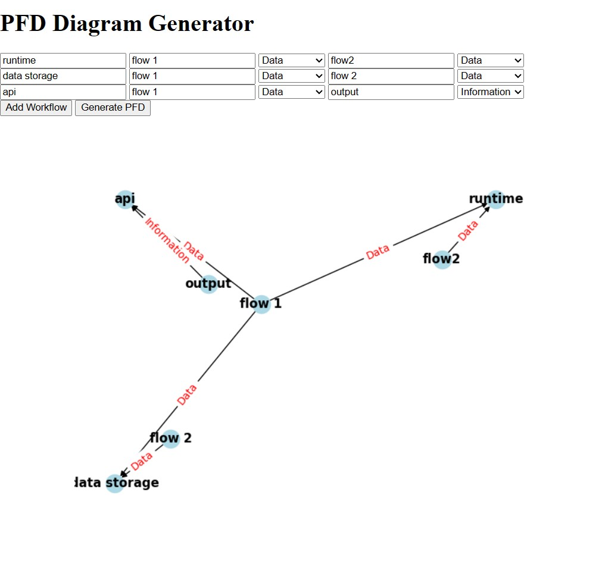

# PFD Generator

The PFD Generator is a web-based application that generates Process Flow Diagrams (PFDs) based on user-defined workflows. It allows users to define processes and data entities, and visually represents the relationships between them in the form of a graph.

## Installation

1. Clone the repository or download the source code.
2. Install the required dependencies by running `pip install -r requirements.txt`.

## Usage

1. Run the application using Gunicorn: `gunicorn pfdgenerator:app`.
2. Access the application in your web browser at `http://localhost:8000`.
3. Enter the workflow data in the provided form. Each workflow consists of a process name, followed by two data entities and their types.
4. Click the "Generate PFD" button to generate the Process Flow Diagram.
5. The generated PFD will be displayed on the web page.

## Sample PFD

The image above is an example of a Process Flow Diagram generated using the PFD Generator application.

## License

This project is licensed under the [MIT License](LICENSE).

